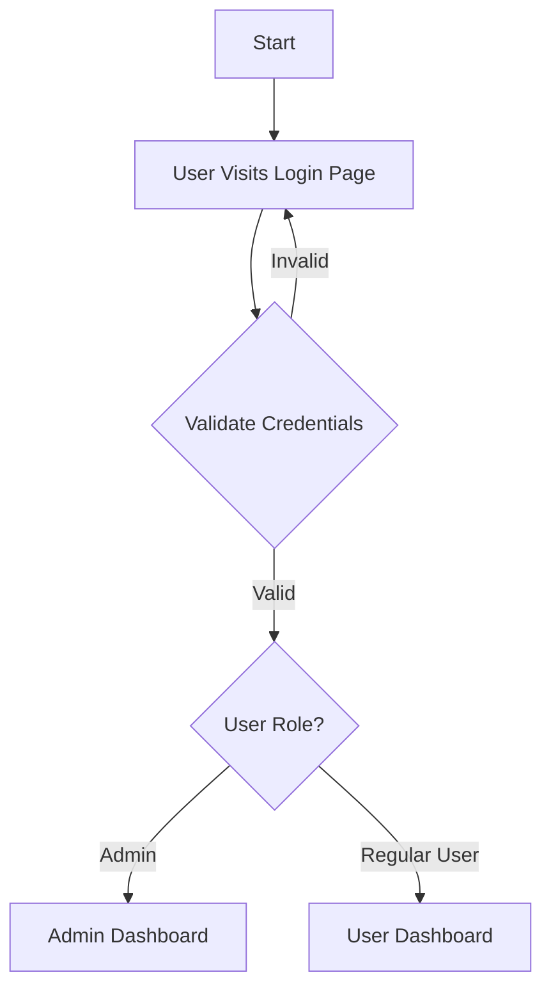
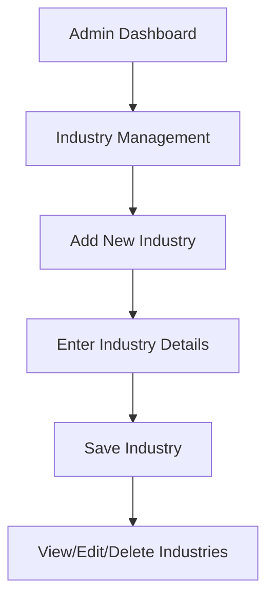
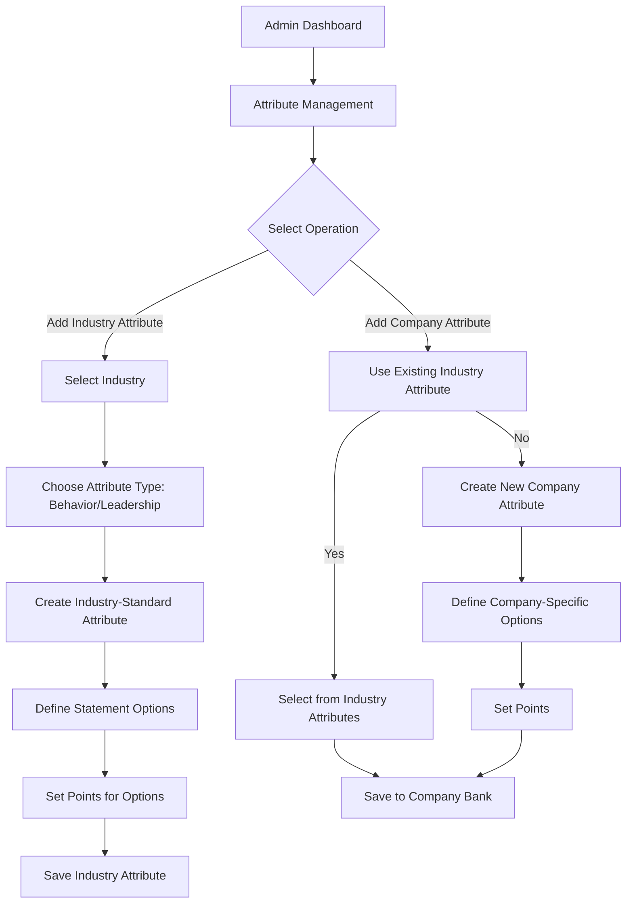
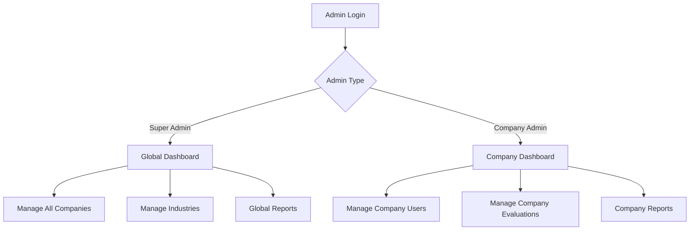
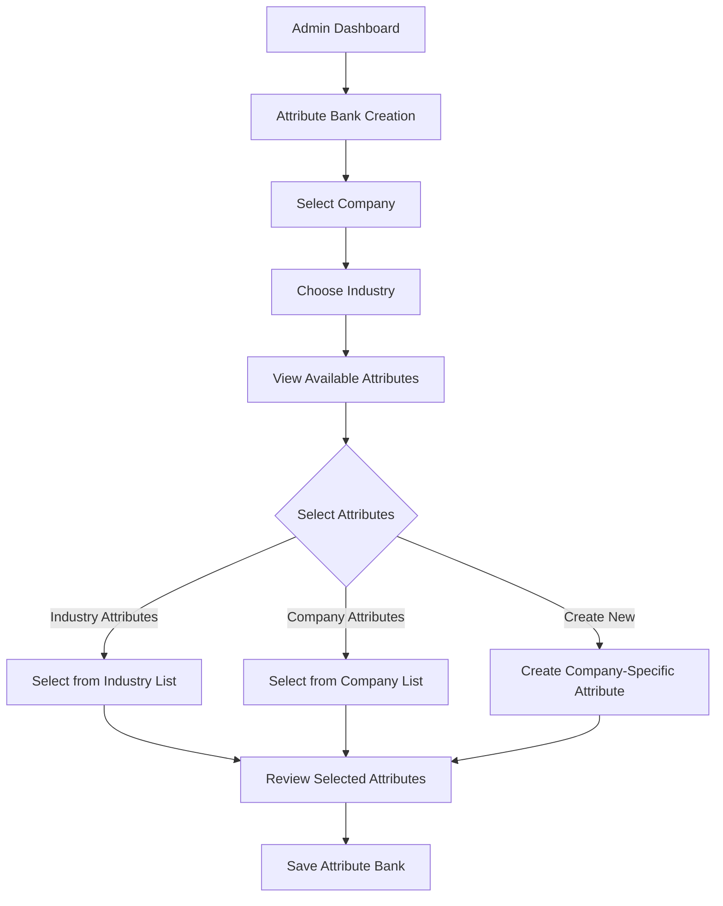
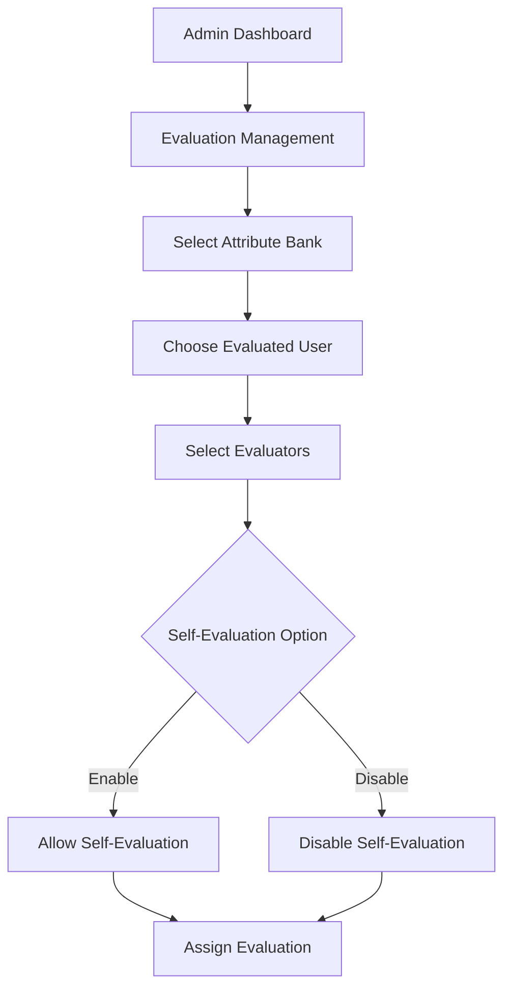
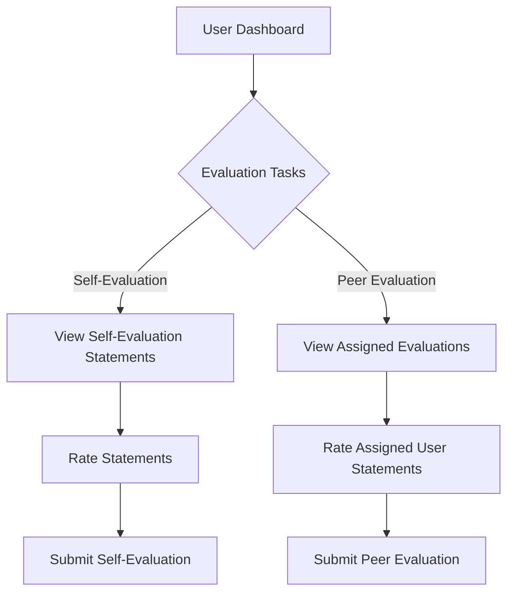
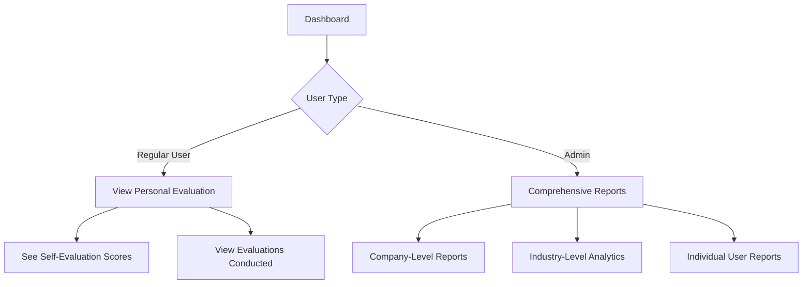
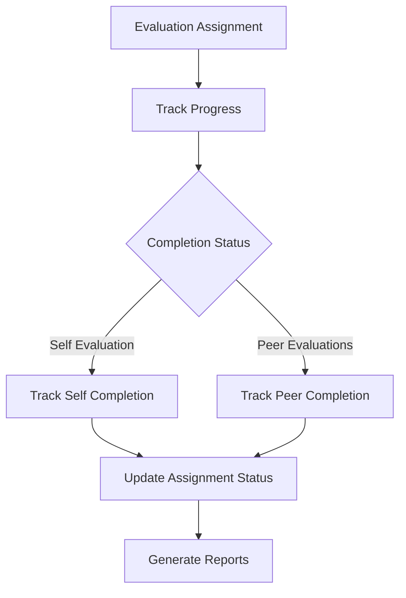
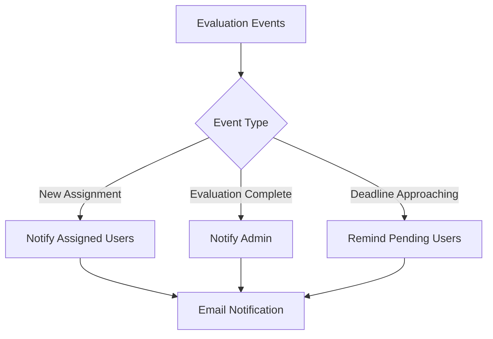

# user flows

# Application Workflow Diagrams

## 1. User Authentication Flow

## 2. Admin Workflow Flows

### 2.1 Industry Management Flow

### 2.2 Attribute Management Flow

### 2.3 Super Admin vs Company Admin

## 3. Attribute Bank Management Flow

## 4. Evaluation Assignment Flow

## 5. User Evaluation Flow

## 6. Reporting Flow

## 7. Evaluation Progress Tracking

## 8. Notification Flow

## Detailed User Types and Permissions

### Super Admin Permissions:
1. Everything a Company Admin can do
2. Manage Multiple Companies
3. Create/Modify Industries
4. View Cross-Company Analytics
5. Manage Global Settings

### Company Admin Permissions:
1. Manage Company Users
2. Create/Modify Attribute Banks
3. Assign Evaluations
4. View Company Reports
5. Manage Company Settings

### Regular User Permissions:
1. View Personal Dashboard
2. Complete Self-Evaluations
3. Conduct Assigned Peer Evaluations
4. View Own Evaluation History

## Key Workflow Considerations

- Centralized login mechanism
- Role-based access control
- Flexible evaluation assignment
- Comprehensive reporting
- Data privacy and visibility controls

## Potential Enhancement Areas

1. Multilevel evaluation workflows
2. Advanced reporting and analytics
3. Integration with performance management systems
4. Export and sharing capabilities